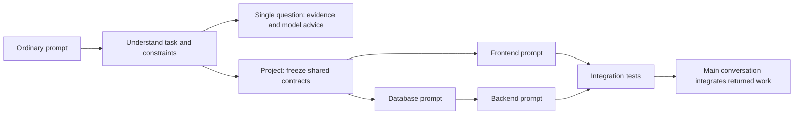

<p align="center">
  
</p>
<p align="center">
  <a href="LICENSE"></a>
  <a href="CHANGELOG.md"></a>
  <a href="skills/promptharbor/SKILL.md"></a>
  <a href="docs/COVERAGE.md"></a>
</p>
<p align="center"><b>Give it a question. Choose from its Top 3 models.<br>Give it a project. Get coordinated model handoffs.</b></p>
<p align="center">English · <a href="README.zh-CN.md">简体中文</a></p>

PromptHarbor is an Agent Skill that identifies the **domain, subdomain and task**
behind an ordinary prompt, then recommends suitable language models using
task-specific evaluations and weighted community reports. It offers **Top 3 choices**
so you can use the subscriptions, APIs and tools you already have. For a larger
project, it splits the work, offers Top 3 per part, and writes copyable prompts
with shared interfaces. The
original conversation brings the returned work together.

The host performs semantic classification and live research; local helpers
produce inspectable choices and validate handoffs without API keys.

## See the difference

> “Design an interactive landing page. I have GPT-6.1 Sol, Kimi K3 and DeepSeek V4.1 Flash.”

| Top 3 | Task-fit reason | Resource consideration |
|---|---|---|
| GPT-6.1 Sol | Stronger same-cohort WebDev support in this snapshot | Account tools and quota |
| Kimi K3 | WebDev evidence plus artifact-backed visual-web reports | Style fit, quota and conflicting feedback |
| DeepSeek V4.1 Flash | Another available candidate with task evaluation evidence | Deployment, cost and interaction checks |

This visual-design example is restricted to the stated resources. See its
[complete output with sources and dates](examples/frontend-output.md).
Without a resource list, the skill offers a broader Top 3; with one, it filters.

**A question**

> “Check this Python trading backtest for look-ahead bias.”

→ Quantitative finance + repository analysis. Shortlist models with relevant
coding evidence, identify finance-specific evidence gaps, and decide whether a
switch is justified. Validate time splits, costs and leakage; a coding score
does not prove trading profitability.

**A project**

> “Build a library management system with book ratings and reviews.”

| Part | How choices work | Handoff boundary |
|---|---|---|
| Frontend | Top 3 from task evaluations and community reports | UI states, typed API client, exact routes |
| Database | Keep declared current GPT-6.1 Sol as a baseline | Schema, constraints, seed and SQL checks |
| Backend | Top 3; user selects one for the shared contract | API contract, transactions, error responses |
| Tests | Select an eligible suggestion; keep a supported current baseline when appropriate | End-to-end scenarios and observed results |
| Integration | Original conversation | Review, assemble, fix mismatches, run checks |

Each part uses the same interfaces whichever candidate you choose. See the [source-backed example](examples/library-system/project.json) and
[complete generated prompts](examples/library-system/handoffs/PLAN.md).

A **planning default** is a replaceable suggestion. It does not require an account
for that model. Supply `available_models` to use your own resources; the example's
declared `current_model` is not a global default.



## What it does

- **Recognizes intent:** the host classifies ordinary prompts, mixed tasks and
  long projects; users do not need to choose a benchmark first.
- **Offers three choices:** exact versions, concise reasons, sources and resource
  tradeoffs; optionally restrict to models you can already access.
- **Uses community experience across the catalog:** task-specific editorial
  scores out of 10, source links, reasons, confidence and freshness; artifact
  quality, author deduplication and adverse reports affect their influence.
- **Handles handoffs:** complete prompts printed in the current conversation,
  contracts, file ownership, dependency order and return receipts.
- **Keeps documents in your language:** Chinese requests produce Chinese plans,
  recommendation explanations and handoff prompts, as well as Chinese chat replies.
- **Keeps switching practical:** stay, test first, consider switching, or unknown.
  Reusing one model across components is often reasonable.
- **Works across providers:** cloud and open-weight candidates are considered.
  Hardware only matters when local deployment is explicitly required.

## Install

Clone the repository, then install the skill:

```sh
git clone https://github.com/ylv01/prompt-harbor.git
cd prompt-harbor

# Codex (respects CODEX_HOME if set)
python scripts/install.py --host codex

# Claude Code directory convention
python scripts/install.py --host claude

# Any compatible host's skill directory
python scripts/install.py --dest /path/to/your/skills
```

Use Python 3.10+ (`python3` on some systems). The installer copies only the
self-contained `skills/promptharbor` directory and refuses to overwrite an
existing installation. Reload the host's skills or start a new conversation.
Other hosts can load that folder directly. Host-specific discovery behavior
varies; a skill does not independently intercept every message.

No Python is needed for the host to read the skill and evidence. Python enables
the optional CLI, packaging and handoff validators. No model API calls, account
credentials, telemetry or automatic model switching are included.

## Use it

```text
Use $promptharbor to give me Top 3 models for each problem in this conversation.
For projects, split the work and print separate copyable prompts. Keep this
conversation responsible for integration when I return the outputs.
```

Then send a normal question or project brief. For a one-off request:

```text
$promptharbor Which model fits this task: prove the lemma below in Lean?
```

Project prompts include goals, frozen contracts, dependencies, owned files and
acceptance tests. Send them to the chosen models, then bring their complete files
and receipts back to the main conversation. The skill reviews and integrates
them in the authorized workspace. This is user-mediated coordination, not a
service that logs into model providers or dispatches API calls.

Plans and full handoff prompts follow the user's language. Local helpers support
`language: "auto"`, `"zh-CN"` (`"zh"` alias) and `"en"`; `--language` overrides
the JSON setting. Auto recognizes Chinese prompt/project text and otherwise uses
English. The host writes supplied task descriptions in the intended language;
model IDs, code, paths, JSON fields and frozen contracts retain their original text.

## Try the local helpers

```sh
python skills/promptharbor/scripts/harbor.py validate
python skills/promptharbor/scripts/harbor.py community
python skills/promptharbor/scripts/harbor.py recommend --job examples/frontend.json
python skills/promptharbor/scripts/harbor.py recommend --job examples/backtest.json
python skills/promptharbor/scripts/harbor.py recommend --job examples/glm.json
python skills/promptharbor/scripts/harbor.py recommend --prompt "Summarize this video"
python skills/promptharbor/scripts/project.py compile --project examples/library-system/project.json --out out/handoffs
python skills/promptharbor/scripts/project.py compile --project examples/library-system/project.json --out out/handoffs-zh --language zh-CN
python -m unittest discover -s tests -v
```

`--prompt` is a conservative English/Chinese keyword fallback with explicitly
low confidence. Semantic classification and project decomposition belong to
the host skill. For reliable CLI use, pass a host-authored structured job.
See [job format](skills/promptharbor/references/job-format.md) and
[project format](skills/promptharbor/references/projects.md).

For reproducible historical examples, use the date recorded with the example
(`--as-of 2026-10-08` for the current snapshot); omit it for
current advice. Expired records are excluded and may yield no recommendation.

## Evidence and community feedback

The **2026-10-08 snapshot includes 16 models and 49 task leaves**. Community
research has been performed for every catalog model. [Coverage and gaps](docs/COVERAGE.md)
list the current evidence/source counts; [community assessments](docs/COMMUNITY.md)
show model-by-task scores, origins and sources. Tasks without suitable reports
remain unrated.

| Provider | Catalog models |
|---|---|
| OpenAI | GPT-6.1 Sol, GPT-6 Astra, GPT-6 Luna |
| Anthropic | Claude Opus 5.5, Sonnet 5.5, Fable 5.1 |
| Google | Gemini 3.8 Flash |
| DeepSeek | DeepSeek V4.1 Flash |
| Alibaba | Qwen3.8-27B |
| Moonshot AI | Kimi K3 |
| xAI | Grok 4.7 |
| Xiaomi | MiMo-V2.6-Pro, MiMo-V2.6-Flash, MiMo-V2.6-Pro-UltraSpeed |
| Z.ai | GLM-5.3, GLM-5.3-Flash |

Sources include official documentation, model cards, independent evaluations
and attributed firsthand community reports. [Research notes](docs/RESEARCH.md) explain
what was inspected, including related projects. Every admitted claim links to
its source; original tables, articles and model weights are not redistributed.

Current recommendations require the host to check availability, versions and
fresh task-specific evidence online. Offline output is snapshot-based. The
[refresh process](skills/promptharbor/references/refresh.md) and weekly freshness
workflow identify review work; they never auto-promote scraped claims.
See [methodology](skills/promptharbor/references/evidence.md) and
[third-party attribution](THIRD_PARTY.md).

Community weights default to **30% for visual frontend work, 25% for most writing,
15% generally, and 5% for financial/medical/legal tasks**. These are adjustable
editorial defaults, with a per-job override from 0 to 40%. Reference fidelity
uses 20%. Every admitted community report has an **editorial score from 0 to 10**,
a rationale, assessment date and confidence. Scores describe the specific task
reported; they are not benchmark measurements. Linked artifacts receive more
support than anecdotes; duplicates add nothing, negative reports can lower the
signal, and undated reports are discounted and expire. Arena crowd evaluations
enter the formal channel once, not again as community anecdotes.

The sample now spans coding, review, writing, frontend, multimodal extraction and
other reported tasks across the catalog. Positive and adverse findings remain
visible together. See [community scores and sources](docs/COMMUNITY.md),
[the policy and formula](skills/promptharbor/references/community.md), and the
[per-model search log](skills/promptharbor/data/community_research.json).

Xiaomi's [September 27 technical note](https://mimo.xiaomi.com/blog/mimo-v2-6-tool-call-repetition)
says the September 25 MiMo API update mitigated repeated tool calls; PromptHarbor
has not independently reproduced that mitigation. The known September 22 OpenCode
complaint is marked as historical; unrelated reports retain their own scope.
Original RL-checkpoint benchmark results are not transferred to the current MOPD
deployment. Pro and Flash have open weights; UltraSpeed is a hosted service tier
without a separate downloadable checkpoint. Choose Pro or Flash for local use;
the hosted UltraSpeed acceleration is not a local model feature.

## Working boundaries

- **Conditional Top 3:** task, setup and your resources determine the shortlist.
  Fewer than three supported candidates means fewer suggestions, with a reason.
- **Current evidence:** verify versions and access live; offline advice uses the
  dated snapshot. Missing providers and new releases can be added through research.
- **Task fit needs validation:** aesthetic preference, reference fidelity and
  production correctness require different checks. Recommendation accuracy has
  not yet been measured in a blinded cross-model outcome study.
- **You choose; the main window integrates:** prompts move between models through
  you. Shared contracts and actual integration tests govern acceptance; API prices
  and a model name alone do not establish subscription access or total cost.

## Repository

```text
skills/promptharbor/    Portable skill, evidence data, helpers and references
examples/              Single-task jobs and a complete project handoff example
tests/                 Deterministic recommendation and delivery validation
evals/                 Host-level behavioral cases and evaluation rubric
assets/                Original logo, avatar, social preview and local badges
scripts/               Installer, packaging, documentation and freshness checks
docs/                  Research, coverage, design and release guide
.github/               CI, freshness reporting and contribution templates
```

## Develop and release

```sh
python scripts/check_repo.py
python scripts/freshness.py
python scripts/package_skill.py
```

The ZIP archive is written to `dist/`. See
[CONTRIBUTING.md](CONTRIBUTING.md), [brand assets](assets/brand/README.md) and
[release preparation](docs/RELEASING.md).

## License

Original code, documentation, data curation and artwork are licensed under
[Apache License 2.0](LICENSE). Third-party source materials and model weights
retain their own terms. PromptHarbor is independent and is not endorsed by the
model providers or benchmark publishers.
